# Конфигурация обучения

```text
- batch_size: 64
- epochs: 10
- lr: 0.001
- optimizer: AdamW
- num_workers: 2
```

Обучение проводилось на видеокарте NVIDIA GeForce RTX 2080.

# Задание 1.1. Сравнение архитектур на MNIST

Все модели обучались с одинаковыми гиперпараметрами.
**Рядом с названием модели в скобках написано название ее класса в коде.**

## Полносвязная сеть (FCModel)

### Метрики


| Метрика                            | Значение |
| ----------------------------------------- | ---------------- |
| Train Accuracy                            | 0.9911           |
| Test Accuracy                             | 0.9799           |
| Количество параметров | 567434           |
| Время обучения               | 199.41 сек    |
| Время инференса             | 7.10    сек   |

### Кривые обучения

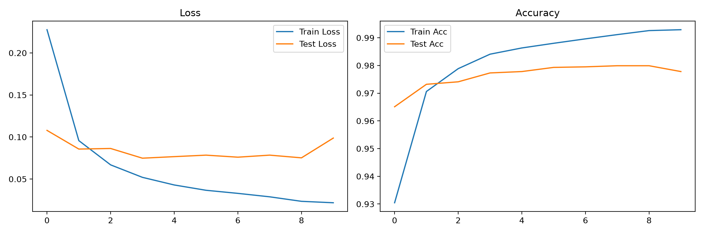

## Простая CNN (SimpleCNN)

### Метрики


| Метрика                            | Значение |
| ----------------------------------------- | ---------------- |
| Train Accuracy                            | 0.9959           |
| Test Accuracy                             | 0.9923           |
| Количество параметров | 421642           |
| Время обучения               | 205.79  сек   |
| Время инференса             | 7.29    сек   |

### Кривые обучения

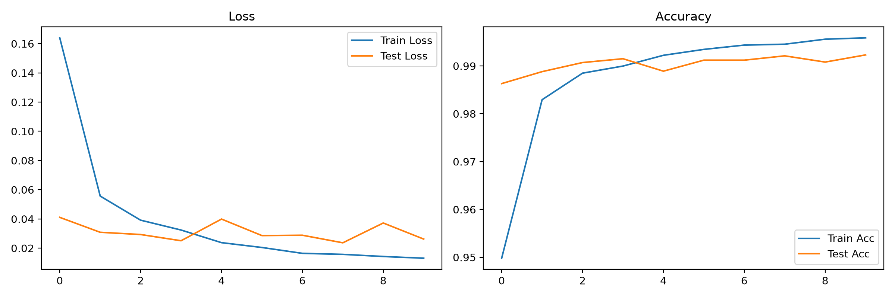

## CNN + Residual Block (CNNWithResidual)

### Метрики


| Метрика                            | Значение |
| ----------------------------------------- | ---------------- |
| Train Accuracy                            | 0.9927           |
| Test Accuracy                             | 0.9937           |
| Количество параметров | 160906           |
| Время обучения               | 235.49 сек    |
| Время инференса             | 8.56 сек      |

### Кривые обучения

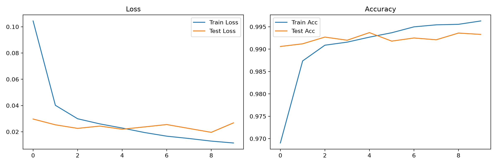

## Сводная таблица


| Модель   | Train Acc |   Test Acc | Параметров | Время обучения | Время инференса |
| -------------- | --------: | ---------: | -------------------: | --------------------------: | ----------------------------: |
| MLP            |    0.9911 |     0.9799 |               567434 |               199.41 сек |                   7.10 сек |
| Simple CNN     |    0.9959 |     0.9923 |               421642 |               205.79 сек |                   7.29 сек |
| CNN + Residual |    0.9927 | **0.9937** |           **160906** |               235.49 сек |                   8.56 сек |

## Вывод

- Полносвязная сеть показала худшее качество среди рассмотренных моделей, при этом имеет наибольшее количество параметров.
- Простая CNN значительно улучшает точность классификации, одновременно уменьшая число параметров относительно MLP.
- CNN с residual-блоком достигла лучшей точности на тестовой выборке (99.37%), несмотря на наименьшее число параметров. Это говорит о более эффективном использовании параметров благодаря остаточным соединениям.
  Недостатком residual-модели является немного большее время обучения и инференса, однако прирост качества делает такую архитектуру наиболее предпочтительной.

# Задание 1.2. Сравнение архитектур на CIFAR-10

Все модели обучались с одинаковыми гиперпараметрами.

## Полносвязная сеть (DeepFCModel)

### Метрики


| Метрика                            | Значение |
| ----------------------------------------- | ---------------- |
| Train Accuracy                            | 0.6686           |
| Test Accuracy                             | 0.5419           |
| Количество параметров | 9050378          |
| Время обучения               | 316.42   сек  |
| Время инференса             | 12.10     сек |

### Кривые обучения

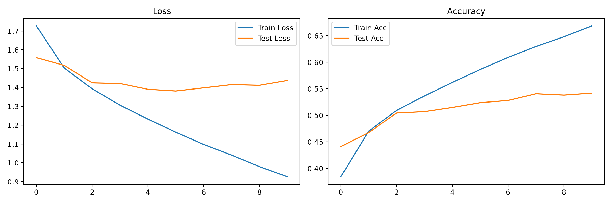

### Confusion Matrix

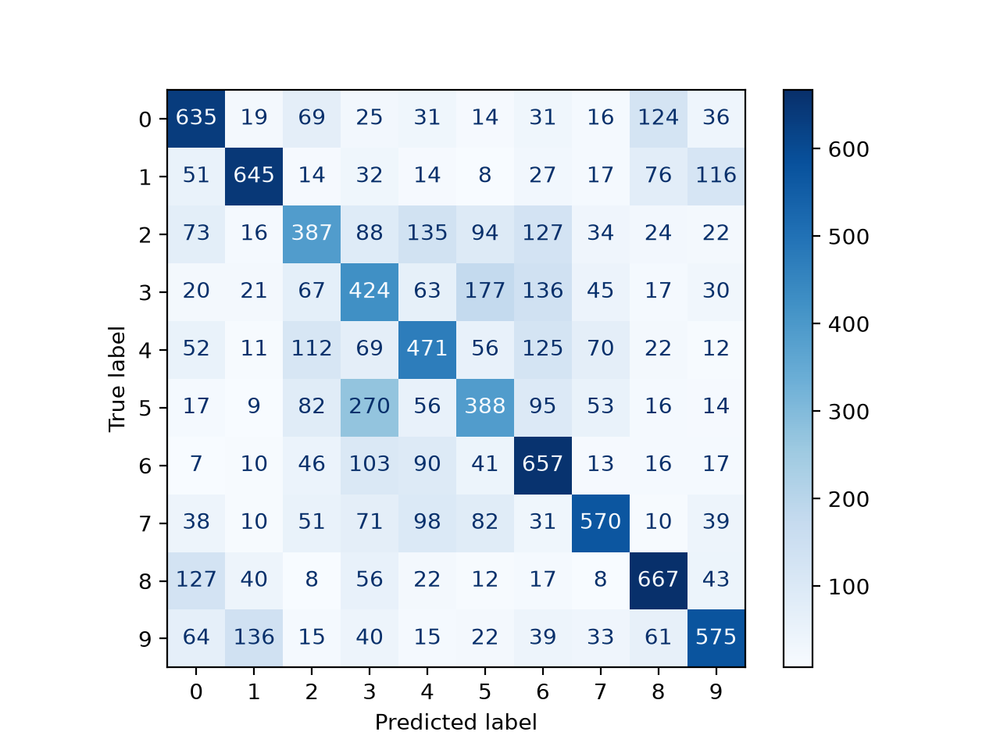

### Gradient Flow


| Тип графика | График                                        |
| --------------------- | --------------------------------------------------- |
| Norm Gradient         | 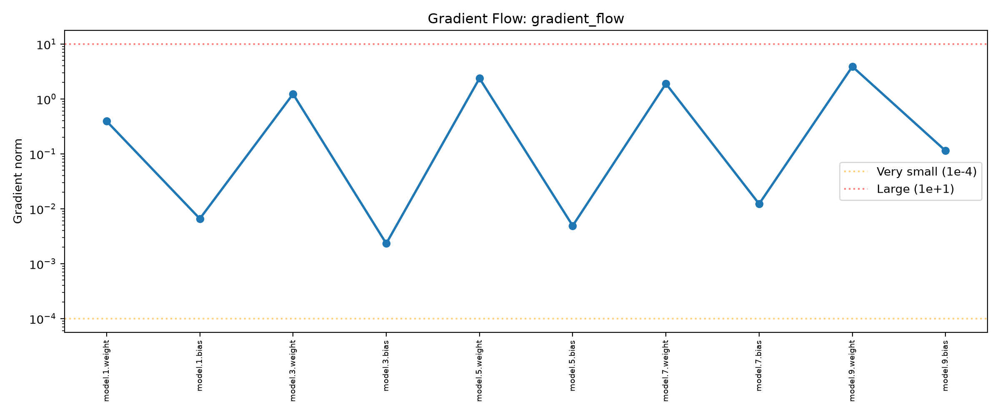  |
| Relative Gradient     | 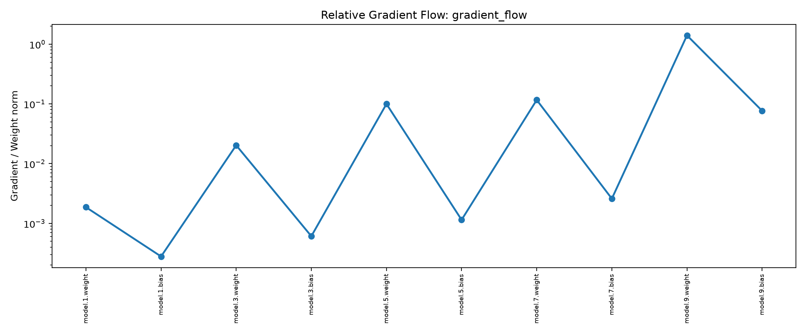 |

## CNN + Residual Block (CNNWithResidual)

### Метрики


| Метрика                            | Значение |
| ----------------------------------------- | ---------------- |
| Train Accuracy                            | 0.9039           |
| Test Accuracy                             | 0.8353           |
| Количество параметров | 161482           |
| Время обучения               | 337.99 сек    |
| Время инференса             | 14.43     сек |

### Кривые обучения

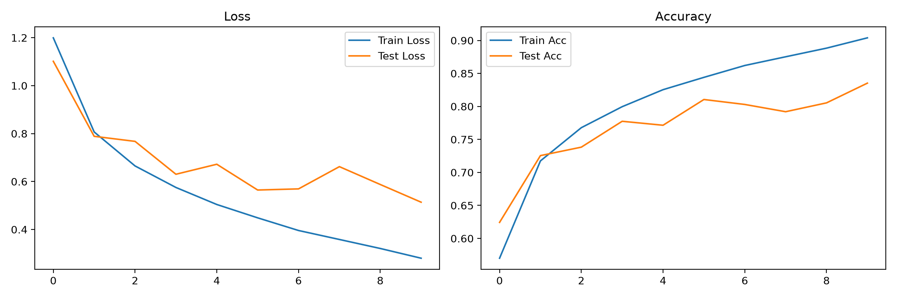

### Confusion Matrix

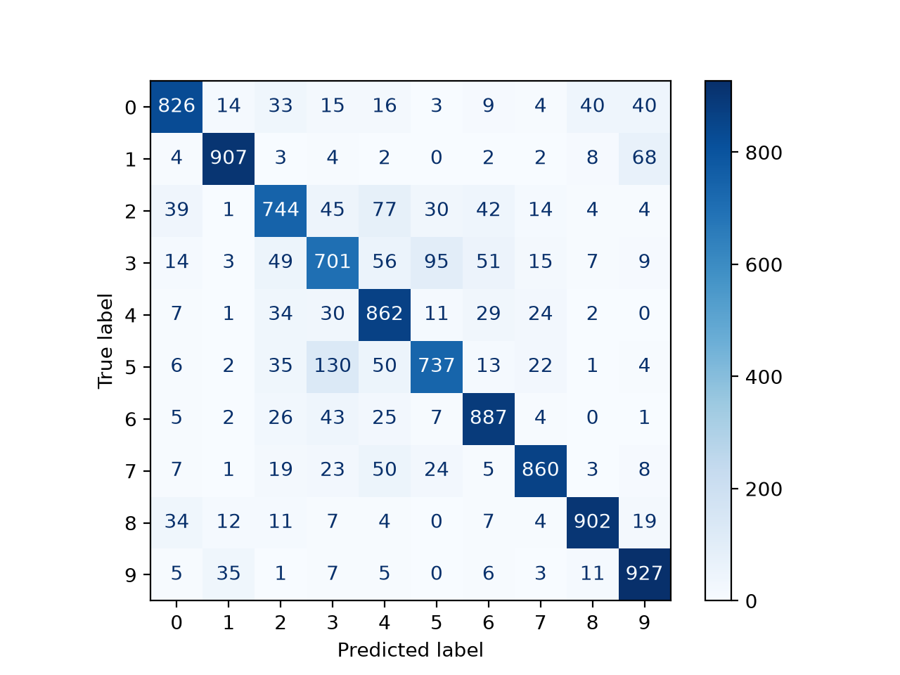

### Gradient Flow


| Тип графика | График                                                        |
| --------------------- | ------------------------------------------------------------------- |
| Norm Gradient         | 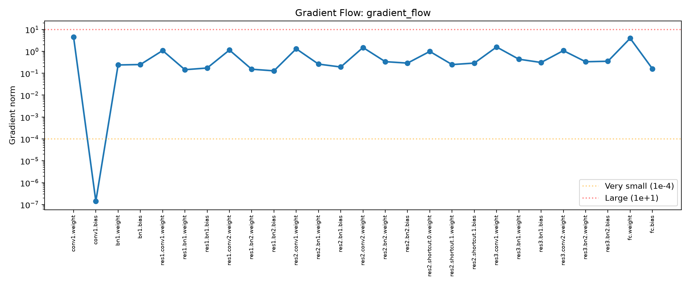  |
| Relative Gradient     | 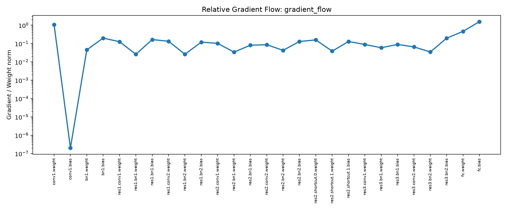 |

## CNN + Regularization + Residual (RegularizedResidualCNN)

### Метрики


| Метрика                            | Значение  |
| ----------------------------------------- | ----------------- |
| Train Accuracy                            | 0.7495            |
| Test Accuracy                             | 0.7867            |
| Количество параметров | 161482            |
| Время обучения               | 359.69     сек |
| Время инференса             | 14.57      сек |

### Кривые обучения

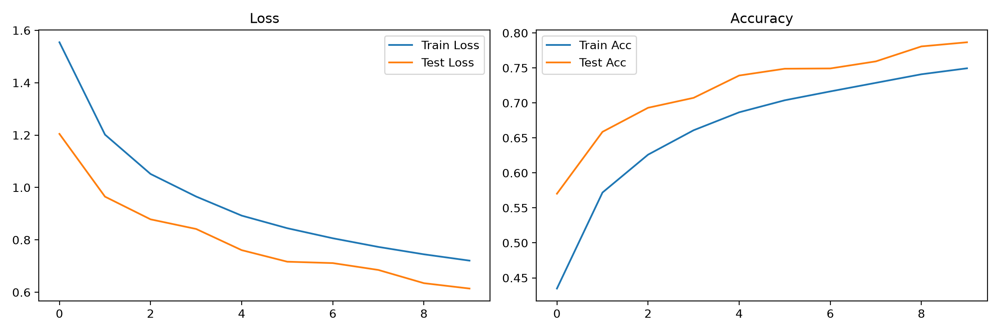

### Confusion Matrix

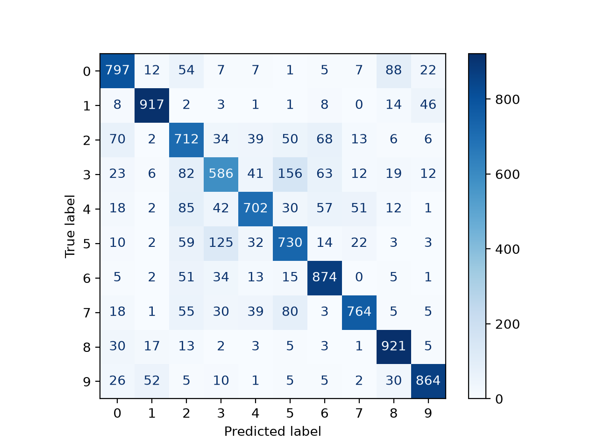

### Gradient Flow


| Тип графика | График                                                         |
| --------------------- | -------------------------------------------------------------------- |
| Norm Gradient         | 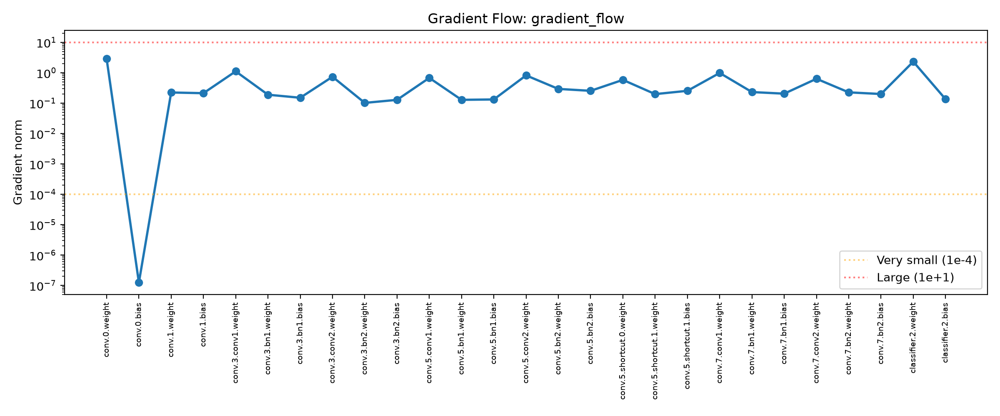  |
| Relative Gradient     | 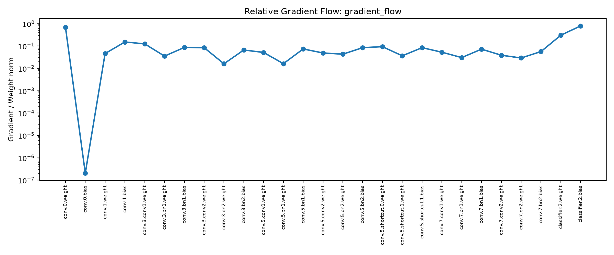 |

## Сводная таблица


| Модель                    |  Train Acc |   Test Acc | Параметров | Время обучения | Время инференса |
| ------------------------------- | ---------: | ---------: | -------------------: | --------------------------: | ----------------------------: |
| MLP                             |     0.6686 |     0.5419 |              9050378 |               316.42 сек |                  12.10 сек |
| CNN + Residual                  | **0.9095** |     0.7706 |               620362 |           **295.90 сек** |              **11.98 сек** |
| CNN + Residual + Regularization |     0.7495 | **0.7867** |           **161482** |               359.69 сек |                  14.57 сек |

## Вывод

- Полносвязная сеть (MLP) показала худшее качество среди рассмотренных моделей, при этом имеет наибольшее количество параметров, что указывает на неэффективность её архитектуры для сложного датасета CIFAR-10.
- Простая CNN значительно улучшает точность классификации (до 77.06%), одновременно уменьшая число параметров относительно MLP и демонстрируя лучшую скорость обучения.
- CNN с residual-блоком и регуляризацией достигла наилучшей точности на тестовой выборке (78.67%), обладая при этом наименьшим числом параметров среди свёрточных архитектур. Это говорит о более эффективном использовании параметров благодаря остаточным соединениям и регуляризирующим техникам, позволяющим бороться с переобучением на относительно небольшом объёме данных CIFAR-10.
  Недостатком регуляризованной residual-модели является большее время обучения и инференса, прирост качества по сравнению с CNN с residual-блоком небольшой, поэтому residual-модель менее предпочтительна.
- По графикам gradient flow можно сделать вывод относительно обучения каждой модели:

  1. DeepFCModel имеет скачкообразные нормы градиентов, самая вероятная причина - большое количество параметров у weights и малое на bias и отсутствие нормализации.
  2. CNNWithResidual в целом имеет сбалансированные градиенты, имеет провал только в первом bias, самая вероятная причина - после Conv слоя сразу идет BatchNorm, который "обнуляет" полезность bias и уменьшает его градиент через деление на стандартное отклонение.
  3. RegularizedResidualCNN ситуация аналогична модели CNNWithResidual.

# Задание 2.1. Влияние размера ядра свертки

Эксперименты проводились с моделями KernelCNN/KernelMixCNN (размер ядра), DepthCNN (глубина сети).
Карты активаций/признаков содержат 16/32 признаков для компактности.

## Ядро 3×3


| Метрика              | Значение |
| --------------------------- | ---------------- |
| Accuracy                    | 0.7335           |
| Время обучения | 286.82 сек    |
| Параметров        | 549930           |
| Receptive field             | 10 x 10          |

### Активации первого слоя

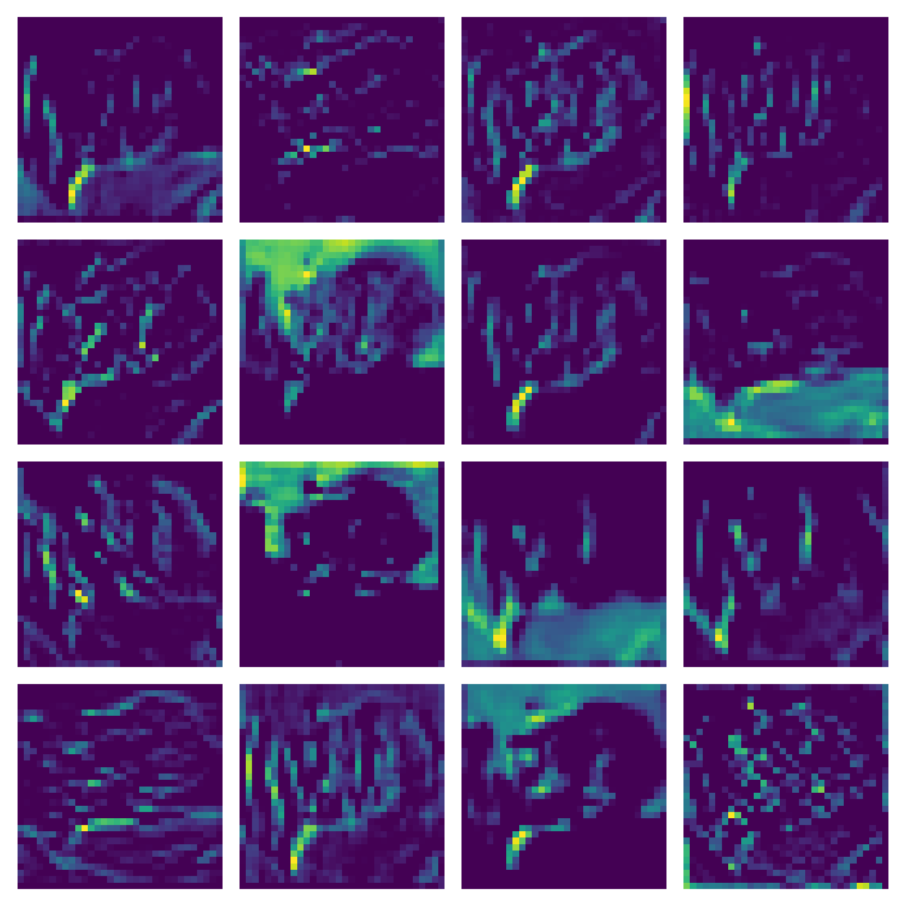

## Ядро 5×5


| Метрика              | Значение |
| --------------------------- | ---------------- |
| Accuracy                    | 0.7170           |
| Время обучения | 307.94 сек    |
| Параметров        | 550034           |
| Receptive field             | 16 x 16          |

### Активации первого слоя

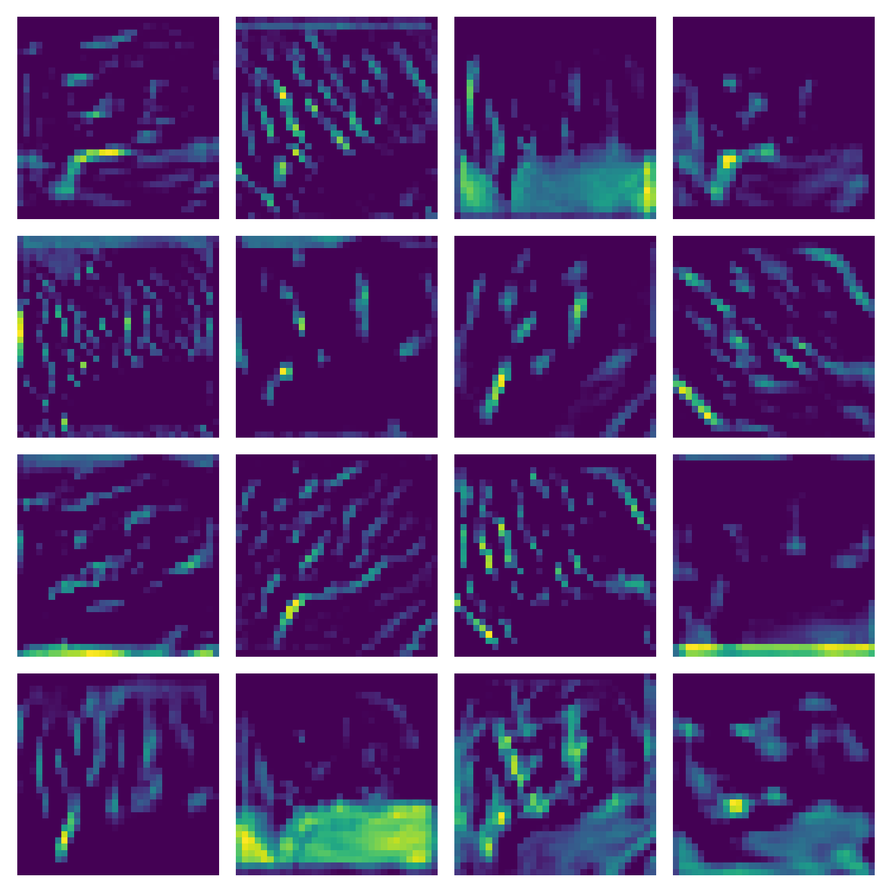

## Ядро 7×7


| Метрика              | Значение |
| --------------------------- | ---------------- |
| Accuracy                    | 0.6885           |
| Время обучения | 306.50  сек   |
| Параметров        | 550012           |
| Receptive field             | 22 x 22          |

### Активации первого слоя

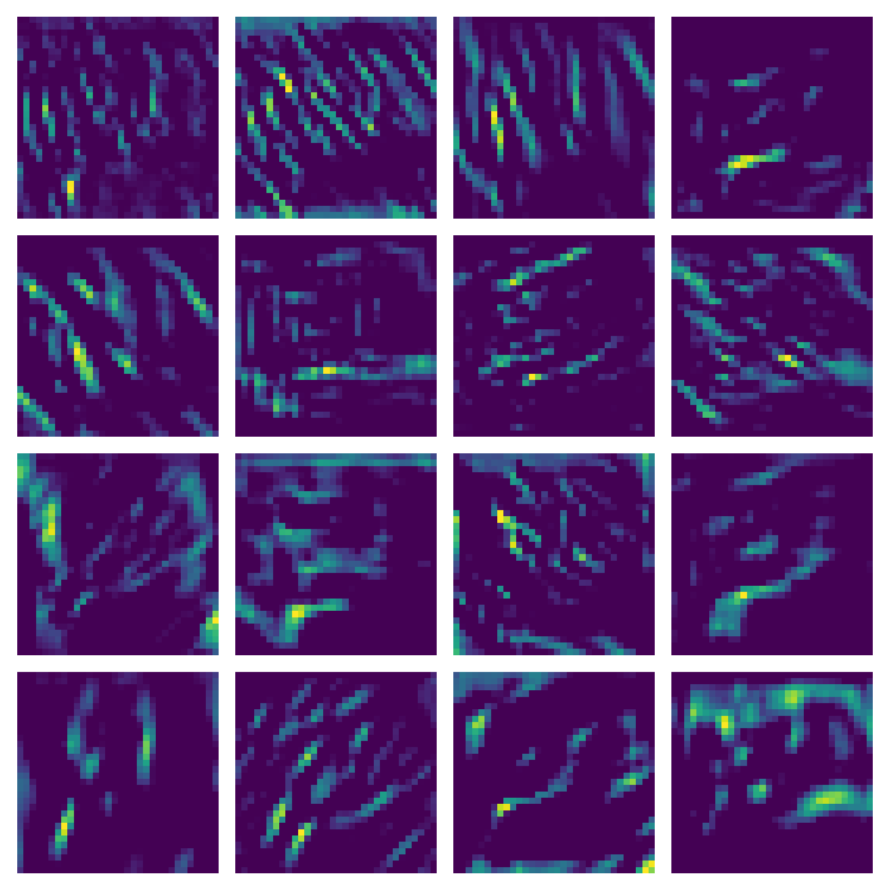

## Комбинация 1×1 + 3×3


| Метрика              | Значение |
| --------------------------- | ---------------- |
| Accuracy                    | 0.7098           |
| Время обучения | 300.23 сек    |
| Параметров        | 549962           |
| Receptive field             | 10 x 10          |

### Активации первого слоя

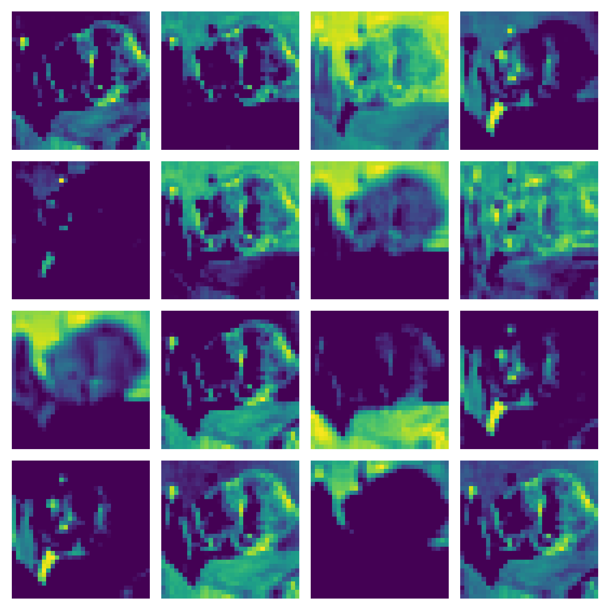

## Сводная таблица


| Конфигурация | Accuracy | Время обучения | Параметров |
| ------------------------ | :------: | :-------------------------: | -------------------: |
| 3×3                     |  0.7335  |        286.82 сек        |               549930 |
| 5×5                     |  0.7170  |        307.94 сек        |               550034 |
| 7×7                     |  0.6885  |        306.50 сек        |               550012 |
| 1×1 + 3×3              |  0.7098  |        300.23 сек        |               549962 |

## Вывод

- Наилучшую точность на датасете CIFAR-10 показала модель с ядрами **3×3** (Accuracy = **0.7335**).
- Увеличение размера ядра до **5×5** и **7×7** не привело к улучшению качества. Напротив, точность снизилась до **0.7170** и **0.6885** соответственно.
- Несмотря на увеличение receptive field (10×10 → 16×16 → 22×22), большие ядра хуже извлекают локальные признаки, характерные для небольших изображений CIFAR-10 (32×32), а также увеличивают вычислительную сложность.
- Конфигурация **1×1 + 3×3** показала промежуточный результат (Accuracy = **0.7098**). Использование свертки 1×1 позволяет смешивать каналы и уменьшать вычисления, однако в данной архитектуре не дало преимущества по качеству.
- Количество параметров во всех экспериментах практически одинаково (≈550 тыс.), поэтому различия в качестве обусловлены именно размером ядра, а не емкостью модели.
- Время обучения также оказалось минимальным у модели с ядром **3×3**, что делает ее наиболее эффективной по соотношению качества и скорости обучения.
  Таким образом, для классификации изображений CIFAR-10 оптимальным выбором среди рассмотренных вариантов являются свертки **3×3**, что соответствует архитектурам современных CNN (например, VGG и ResNet), где несколько небольших ядер предпочтительнее одного большого.

# Задание 2.2. Влияние глубины CNN

## 2 сверточных слоя


| Метрика              | Значение |
| --------------------------- | ---------------- |
| Accuracy                    | 0.7067           |
| Время обучения | 299.21   сек  |

### Feature Map

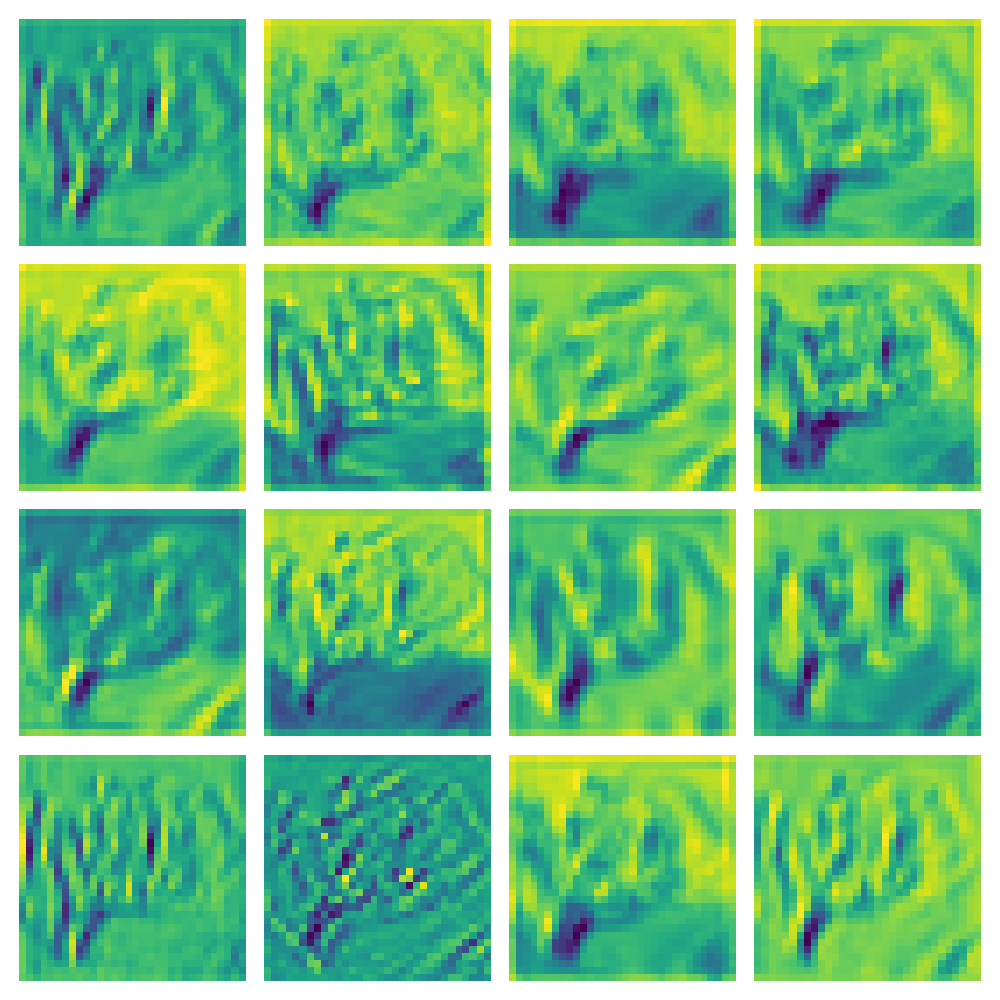

### Gradient Flow


| Тип графика | График                               |
| --------------------- | ------------------------------------------ |
| Norm Gradient         | 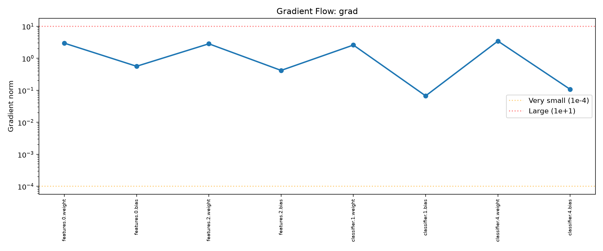  |
| Relative Gradient     | 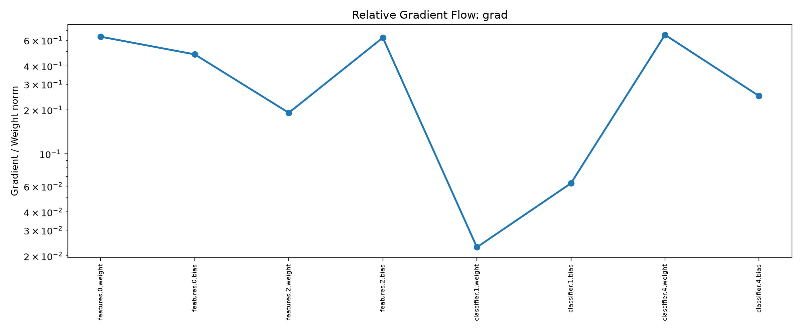 |

## 4 сверточных слоя


| Метрика              | Значение |
| --------------------------- | ---------------- |
| Accuracy                    | 0.7854           |
| Время обучения | 333.98 сек    |

### Feature Map

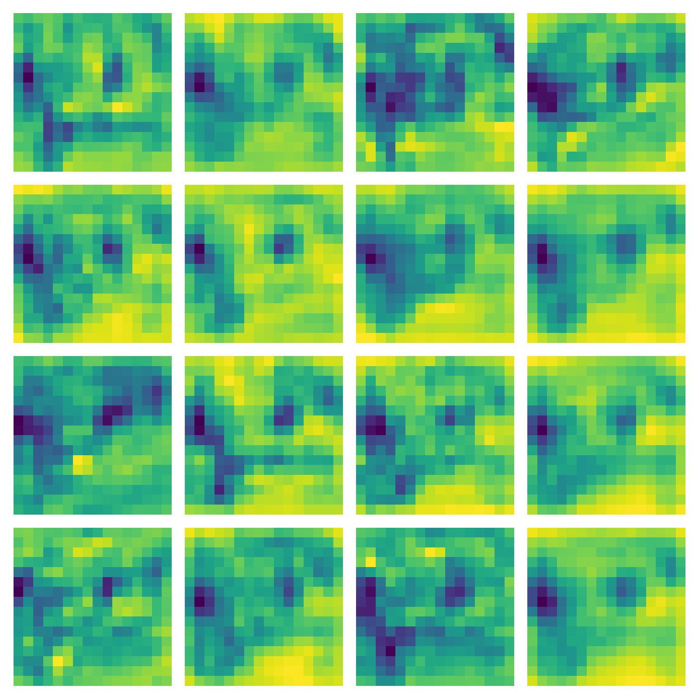

### Gradient Flow


| Тип графика | График                               |
| --------------------- | ------------------------------------------ |
| Norm Gradient         | 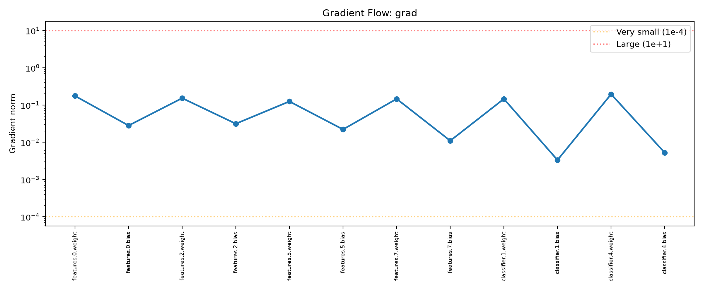  |
| Relative Gradient     | 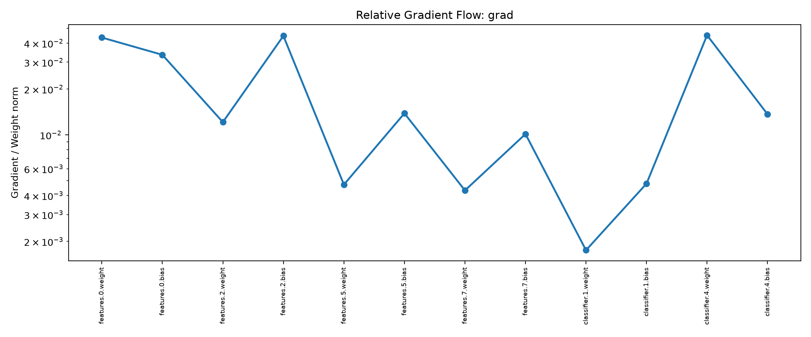 |

## 6+ сверточных слоев


| Метрика              | Значение |
| --------------------------- | ---------------- |
| Accuracy                    | 0.7975           |
| Время обучения | 340.06 сек    |

### Feature Map

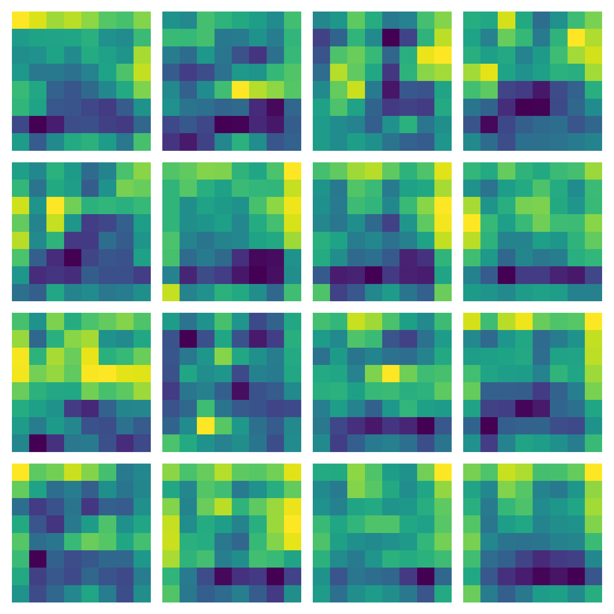

### Gradient Flow


| Тип графика | График                               |
| --------------------- | ------------------------------------------ |
| Norm Gradient         | 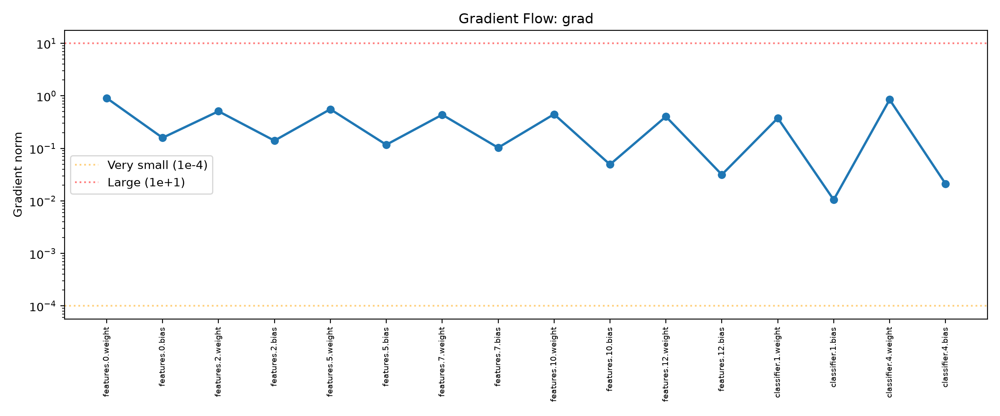  |
| Relative Gradient     | 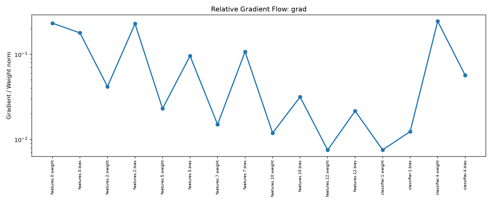 |

## CNN с Residual


| Метрика              | Значение |
| --------------------------- | ---------------- |
| Accuracy                    | 0.8295           |
| Время обучения | 344.49 сек    |

### Feature Map

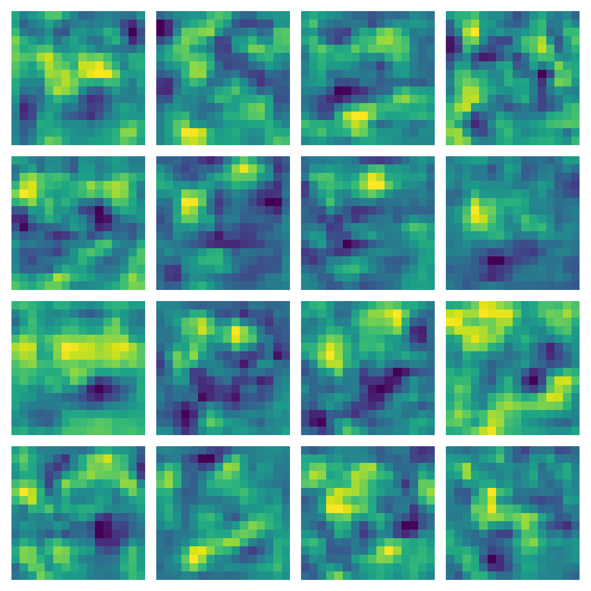

### Gradient Flow


| Тип графика | График                                    |
| --------------------- | ----------------------------------------------- |
| Norm Gradient         | 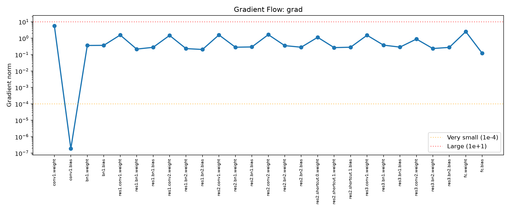  |
| Relative Gradient     | 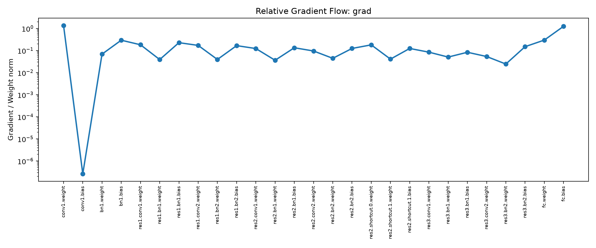 |

## Сводная таблица


| Архитектура | Accuracy | Время обучения | Признаки vanishing gradient |
| ---------------------- | :------: | :-------------------------: | ----------------------------------- |
| 2 слоя             |  0.7067  |        299.21 сек        | Нет                              |
| 4 слоя             |  0.7854  |        333.98 сек        | Нет                              |
| 6+ слоев          |  0.7975  |        340.06 сек        | Нет                              |
| Residual               |  0.8295  |        344.49 сек        | Нет                              |

## Вывод

- Увеличение количества сверточных слоев с 2 до 4 привело к заметному росту точности модели: Accuracy увеличилась с **0.7067** до **0.7854**, при этом время обучения возросло незначительно (с **299.21** до **333.98** секунд). Дальнейшее увеличение глубины до 6+ слоев также улучшило качество классификации (**0.7975**), однако прирост оказался существенно меньше, чем при переходе от 2 к 4 слоям, тогда как время обучения продолжило увеличиваться.
- Наилучший результат показала архитектура с Residual соединениями, достигнув **Accuracy = 0.8295**. При этом время обучения составило **344.49** секунд, что лишь немного больше по сравнению с обычной глубокой CNN. Остаточные связи позволили повысить качество модели без существенного увеличения вычислительных затрат.
- Анализ графиков Gradient Flow показал отсутствие признаков исчезающих/взрывающихся во всех рассмотренных архитектурах. Нормы и относительные значения градиентов оставались стабильными на протяжении сети (за редким исключением, что уже встречалось в предыдущем задании (затухание в первом bias)), что свидетельствует о корректном распространении градиента при обучении.

# Задание 3.1. Кастомные слои

Были реализованы кастомные слои сети: сверточный слой, механизм внимания, функция активации Swish и слой L2 Pooling. Для Swish и L2 Pooling вручную реализованы методы `forward()` и `backward()`. Все слои были протестированы на случайных входных данных.

## Кастомный Conv Layer

Реализован блок:

**Conv2D → BatchNorm → Learnable Scale → ReLU**

По сравнению со стандартным Conv2D добавлен обучаемый коэффициент масштабирования (`scale`), позволяющий изменять амплитуду выходных признаков.

**Результат проверки:**

- Forward и Backward выполнены успешно;
- размер выхода: `torch.Size([2, 16, 32, 32])`.

### Сравнение со стандартным Conv2D


| Custom Conv                                    | Standard Conv                                  |
| ---------------------------------------------- | ---------------------------------------------- |
| Conv + BN + Scale + ReLU                       | Conv + BN + ReLU                               |
| Размер выхода одинаковый | Размер выхода одинаковый |

## Attention Module

Реализован механизм **SE Attention**, который вычисляет веса каналов с помощью Global Average Pooling и двух полносвязных слоев. Полученные веса используются для усиления информативных признаков.

**Результат проверки:**

- Forward и Backward выполнены успешно;
- размер выхода совпадает с входом.

## Кастомная функция активации

Реализована функция **Swish**:

f(x)=x⋅σ(x)

В отличие от ReLU, Swish сохраняет небольшие отрицательные значения, что обеспечивает более плавное распространение градиента.

**Результат проверки:**

- Forward и Backward выполнены успешно.

## Кастомный Pooling

Реализован слой **L2 Pooling**, вычисляющий среднеквадратичное значение признаков вместо среднего или максимума.

**Результат проверки:**

- Forward и Backward выполнены успешно;
- размер выхода: `torch.Size([2, 32, 1, 1])`.

### Сравнение


| L2 Pool         | Max Pool        | Avg Pool        |
| --------------- | --------------- | --------------- |
| `(4, 32, 1, 1)` | `(4, 32, 1, 1)` | `(4, 32, 1, 1)` |

## Вывод

Все пользовательские слои корректно работают, успешно проходят прямой и обратный проходы и могут использоваться при построении собственной архитектуры CNN. Итоговая модель содержит **30068 обучаемых параметров** и формирует выход размерности `torch.Size([4, 10])`.

# Задание 3.2. Эксперименты с Residual Block

## Basic Residual Block

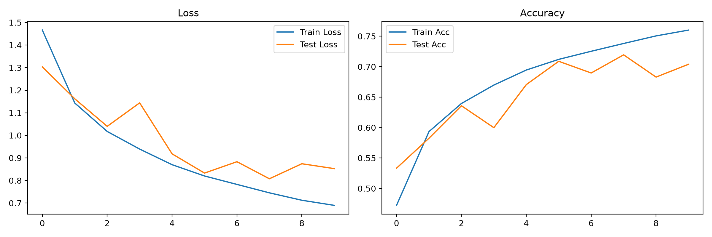


| Метрика              | Значение |
| --------------------------- | ---------------- |
| Accuracy                    |        0.7041          |
| Параметров        |  77898                |
| Время обучения |        305.12   сек       |

## Bottleneck Residual Block

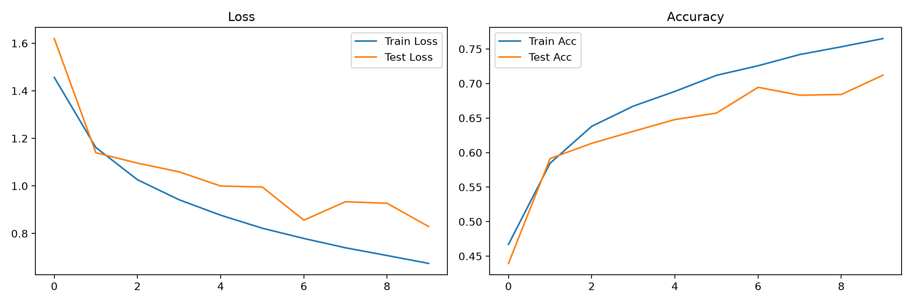


| Метрика              | Значение |
| --------------------------- | ---------------- |
| Accuracy                    |        0.7126          |
| Параметров        |         118090         |
| Время обучения |      394.15    сек        |

## Wide Residual Block

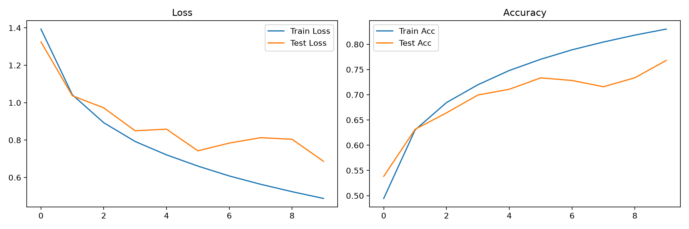


| Метрика              | Значение |
| --------------------------- | ---------------- |
| Accuracy                    |       0.7684           |
| Параметров        | 290122                 |
| Время обучения |        371.34 сек          |

## Сводная таблица

| Блок | Accuracy | Параметров | Время обучения |
|----------|:--------:|-----------:|---------------:|
| Basic | **0.7041** | 77 898 | 305.12 сек |
| Bottleneck | **0.7126** | 118 090 | 394.15 сек |
| Wide | **0.7684** | 290 122 | 371.34 сек |

## Вывод

В ходе эксперимента были исследованы три варианта Residual Block. Наименьшее количество параметров и самое быстрое обучение показал **Basic Residual Block**, однако его точность оказалась самой низкой. **Bottleneck Residual Block** немного улучшил качество классификации, но потребовал больше параметров и времени обучения. Лучший результат по точности продемонстрировал **Wide Residual Block** (0.7684), однако он также оказался наиболее ресурсоемким по количеству параметров. Таким образом, увеличение ширины сети позволило повысить качество модели, но ценой роста вычислительных затрат.

# Общий вывод
- В ходе работы были исследованы различные архитектуры сверточных нейронных сетей и их ключевые компоненты на датасетах MNIST и CIFAR-10, а также проведены дополнительные эксперименты на CIFAR-10, направленные на изучение влияния архитектурных решений на качество классификации.
- Результаты показали, что сверточные нейронные сети существенно превосходят полносвязные модели при решении задач классификации изображений. Особенно заметно это проявилось на более сложном датасете CIFAR-10, где MLP продемонстрировала низкую точность при значительно большем количестве параметров. Использование остаточных (Residual) соединений позволило повысить эффективность обучения, улучшить качество классификации и снизить требования к количеству параметров модели.
- Эксперименты, выполненные на CIFAR-10, показали, что применение небольших ядер свертки размером 3×3 обеспечивает наилучшее соотношение между качеством и вычислительной эффективностью. Увеличение глубины сети способствует росту точности, однако после определенного уровня прирост становится менее выраженным. При этом Residual-соединения позволяют получать дополнительное улучшение качества без существенного увеличения вычислительных затрат и обеспечивают стабильное распространение градиентов.
- Также были разработаны и протестированы кастомные компоненты нейронной сети, включая сверточный слой, механизм внимания, функцию активации Swish и слой L2 Pooling. Все реализованные слои корректно выполняют прямой и обратный проходы и могут использоваться при построении собственных архитектур. Дополнительное сравнение различных типов Residual Block показало, что расширение архитектуры (Wide Residual Block) позволяет добиться наилучшей точности, однако сопровождается увеличением числа параметров и времени обучения.
- Таким образом, поставленные цели работы были достигнуты. Полученные результаты подтверждают, что наилучшее качество классификации на датасете CIFAR-10 обеспечивают глубокие сверточные сети с Residual-соединениями и небольшими ядрами свертки, а выбор конкретной архитектуры должен осуществляться с учетом компромисса между точностью, вычислительными затратами и размером модели.